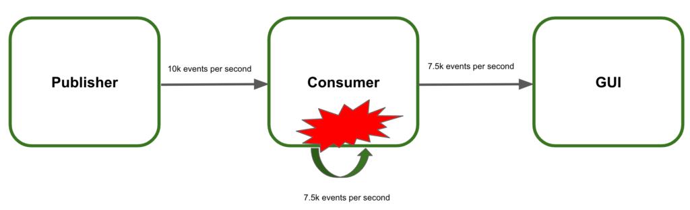
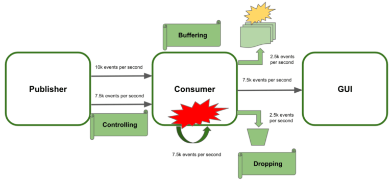
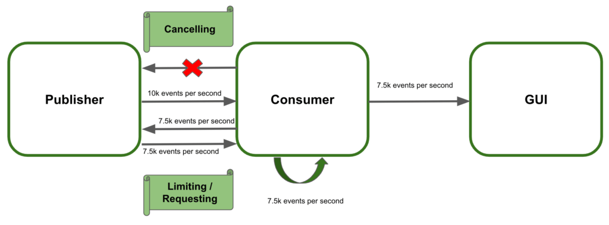

# 문제의 발생
- Subscriber가 처리할 수 없을 만큼의 데이터 유입
- Subscriber가 처리하는 것보다 data가 push될 때
- 이를 해결하는 방법은? -> backpressure

# push vs pull
## push 방식
- publisher가 subscriber에게 데이터를 밀어넣는 방식으로 진행
- publisher는 subscriber의 상태를 고려하지 않음
## pull 방식
- subscriber가 publisher에게 요청
- 모든 data의 크기를 subscriber가 결정함 -> 이것이 backpressure
- ex) subscriber가 5개를 처리 중에 추가로 2개를 더 요청 -> dynamic pull 방식
# Backpressure란?
- stream에서 data의 흐름을 제어 하는 것
- ex) 빠른 Publisher, 느린 Subscriber
# BackPessure를 사용하면?
- Subscriber가 Publisher의 data flow를 제어할 수 있음
- Subscriber가 n 개만큼만 요청이 가능함
- 오류를 방지 할 수 있음
# Backpressure 전략
## 1. Controlling the data stream
- publisher가 전송량을 조절하는 것 -> 현실적인 방법은 아님
## 2. Buffering the extra amount of data
- Subscriber가 data를 메모리상에 보관 -> 메모리 충돌 이슈 있음
## 3. Dropping the extra events
- 처리할 수 없는 data는 버리는 것 -> 나름 이상적일 수 있음, 적어도 시스템 오류는 없을 것

# Backpressure를 통한 제어 전략
## 1. Subscriber의 요청에 의해서만 event publish -> requesting
## 2. 제한 걸기 -> limiting
## 3. publish 취소 -> cancelling

# BackPressure 구현
## 1. onBackpressureDrop()
- unbounded request를 수행
- subscriber가 처리하지 못한다면 나머지 drop
## 2. onBackpressureBuffer()
- unbounded request를 수행
- buffer에 저장을 해두는 것이 특징
- Publisher까지 가지 않아도 되는 장점이 있음
## 3. onBackpressureError()
- Subscriber가 요청한 것 이상으로 publish 된다면 overflowException 발생
## 4. onBackpressureLatest
- unbounded request를 수행
- 가장 최근 것만을 유지`